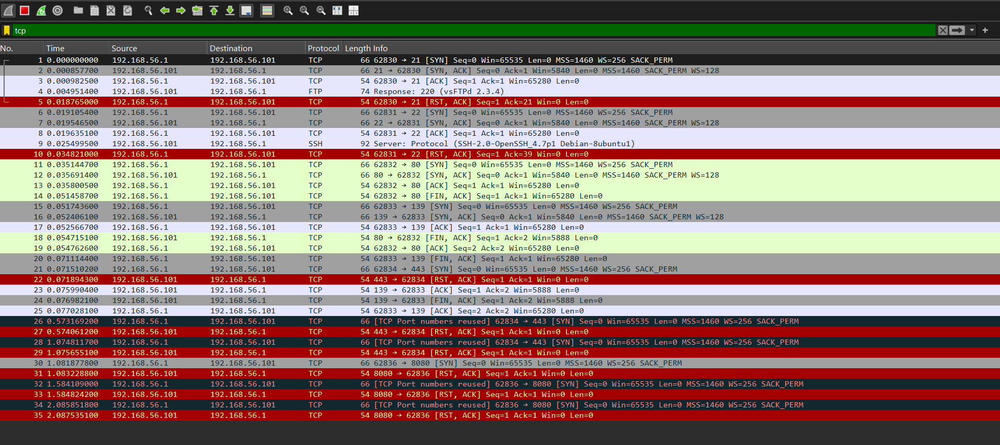

# 🛡️ Scanner de Ports Réseau (Python) & Analyse Wireshark

## 📝 Description du projet
Le but de ce projet était de créer un script en Python pour scanner les ports d'une machine cible et voir s'ils sont ouverts ou fermés. Pour tester le script en toute sécurité, j'ai installé une machine virtuelle (Metasploitable 2) sur VirtualBox. J'ai ensuite utilisé Wireshark pour capturer le trafic en direct et vérifier comment les paquets TCP s'échangent entre mon PC et la machine.

## 🛠️ Outils et notions utilisés
- **Python** : Utilisation du module `socket` pour programmer le scan et tester les connexions.
- **Réseau** : Compréhension du protocole TCP/IP et détection des ports ouverts (comme le FTP ou le SSH).
- **Wireshark** : Capture et analyse des paquets pour voir les connexions se faire en direct.
- **VirtualBox** : Configuration d'un laboratoire virtuel isolé pour faire les tests proprement.

## 📊 Capture du trafic sur Wireshark
Voici la capture d'écran que j'ai obtenue en lançant mon script Python :

*Sur cette capture, on observe clairement l'envoi des paquets TCP [SYN] initiés par le script Python vers la cible, suivi des réponses de la machine virtuelle.*
